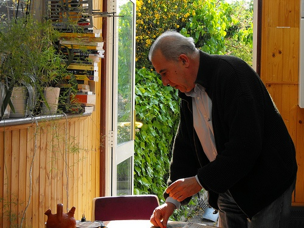
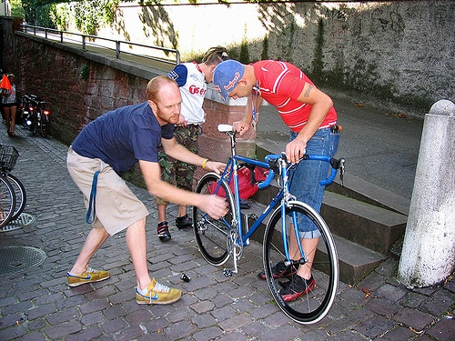
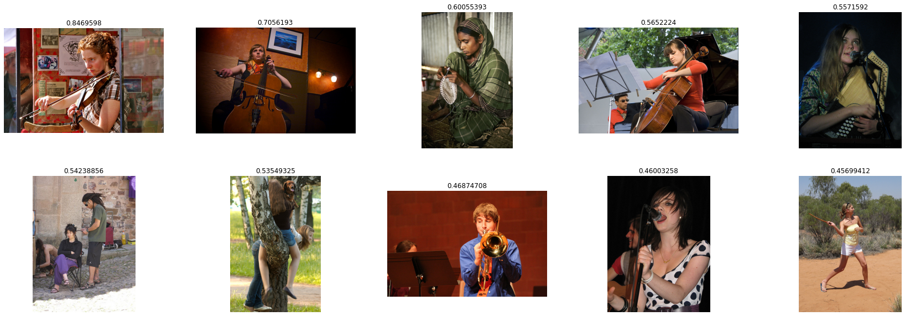
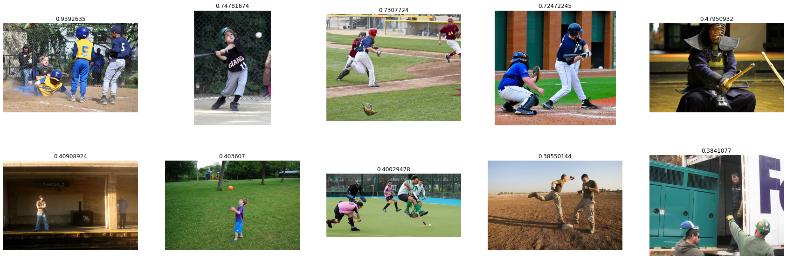
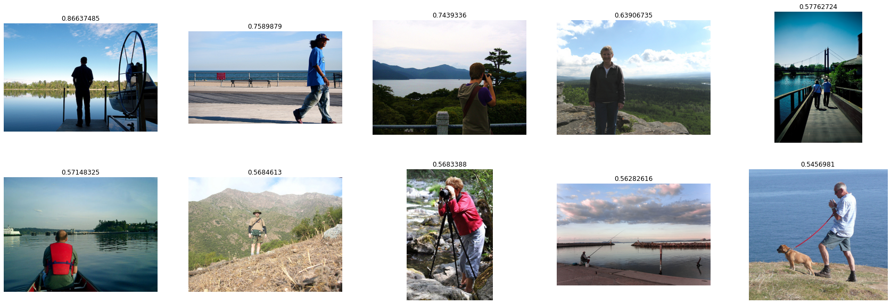

# Cross-modal Retrieval using Transformer Encoder Reasoning Networks

This project reimplements the idea from "Transformer Reasoning Network for Image-Text Matching and Retrieval". To solve the task of cross-modal retrieval, representative features from both modal are extracted using distinctive pipeline and then projected into the same embedding space. Because the features are sequence of vectors, Transformer-based model can be utilised to work best. In this repo, my highlight contribution is:
  - Reimplement TERN module, which exploits the effectiveness of using Transformer on bottom-up attention features and bert features.
  - Take advantage of facebookresearch's [FAISS](https://github.com/facebookresearch/faiss) for efficient similarity search and clustering of dense vectors.
  - Experiment various metric learning loss objectives from KevinMusgrave's [Pytorch Metric Learning](https://github.com/KevinMusgrave/pytorch-metric-learning)
  
The figure below shows the overview of the architecture

<p align="center">

</p>

## Datasets

- I trained TERN on Flickr30k dataset which contains 31,000 images collected from Flickr, together with 5 reference sentences provided by human annotators for each image. 
For each sample, visual and text features are pre-extracted as numpy files

- Some samples from the dataset:

| Images | Captions |
|:-------------------------:|:-------------------------:|
|  | 1. An elderly man is setting the table in front of an open door that leads outside to a garden.<br> 2. The guy in the black sweater is looking onto the table below.<br> 3. A man in a black jacket picking something up from a table.<br> 4. An old man wearing a black jacket is looking on the table.<br> 5. The gray-haired man is wearing a sweater. |
|  | 1. Two men are working on a bicycle on the side of the road.<br>2. Three men working on a bicycle on a cobblestone street.<br>3. Two men wearing shorts are working on a blue bike.<br>4. Three men inspecting a bicycle on a street.<br>5. Three men examining a bicycle.|

## Execution

- Installation
```
pip install -r requirements.txt
apt install libomp-dev
pip install faiss-gpu
```

- Specify dataset paths and configuration in the [config file](./tools/configs/yaml/tern.yaml)

- For training
```
PYTHONPATH=. python tools/train.py 
```

- For evaluation
```
PYTHONPATH=. python tools/eval.py \
                --top_k= <top k similarity> \
                --weight= <model checkpoint> \
```

- For inference
  - See [tools/inference.py](tools/inference.py) script


## Notebooks
- [](./assets/notebooks/TERN.ipynb) Inference TERN on Flickr30k dataset
- [](https://colab.research.google.com/drive/1xC4mVc_bp0t4-7T4xVum3AECFCalsgsv?usp=sharing) Use FasterRCNN to extract Bottom Up embeddings 
- [](https://colab.research.google.com/drive/10dRDQkuZ3KZQ_4bwMbevZoiWzP_OVbVJ?usp=sharing) Use BERT to extract text embeddings 

## Results

- Validation m on Flickr30k dataset (trained for 100 epochs):

Model | Weights | i2t/R@10 | t2i/R@10
--- | --- | --- | ---
TERN | [link](https://drive.google.com/uc?id=1ebQMcKCioE74MJXs8jpoL4WVvCFcb2RI) | 0.5174 | 0.7496

- Some visualization

|**Query text: Two dogs are running along the street**|
|:-------------------------:|
||

|**Query text**: The woman is holding a violin|
|:-------------------------:|
||

|**Query text**: Young boys are playing baseball|
|:-------------------------:|
||


|**Query text**: A man is standing, looking at a lake|
|:-------------------------:|
||


## Paper References

```
@misc{messina2021transformer,
      title={Transformer Reasoning Network for Image-Text Matching and Retrieval}, 
      author={Nicola Messina and Fabrizio Falchi and Andrea Esuli and Giuseppe Amato},
      year={2021},
      eprint={2004.09144},
      archivePrefix={arXiv},
      primaryClass={cs.CV}
}
```

```
@misc{anderson2018bottomup,
      title={Bottom-Up and Top-Down Attention for Image Captioning and Visual Question Answering}, 
      author={Peter Anderson and Xiaodong He and Chris Buehler and Damien Teney and Mark Johnson and Stephen Gould and Lei Zhang},
      year={2018},
      eprint={1707.07998},
      archivePrefix={arXiv},
      primaryClass={cs.CV}
}
```

```
@article{JDH17,
  title={Billion-scale similarity search with GPUs},
  author={Johnson, Jeff and Douze, Matthijs and J{\'e}gou, Herv{\'e}},
  journal={arXiv preprint arXiv:1702.08734},
  year={2017}
}
```

## Code References

- https://github.com/facebookresearch/faiss
- https://github.com/KevinMusgrave/pytorch-metric-learning
- https://github.com/huggingface/transformers
- https://github.com/airsplay/py-bottom-up-attention